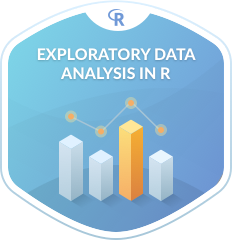

```{r setup, include=FALSE}
knitr::opts_chunk$set(echo = TRUE)
```

## Introduction
In today's presentation, we'll delve into the world of data analysis using R, specifically focusing on analyzing employee data stored in an Excel sheet. Our aim is to demonstrate practical skills that are widely applicable in real-life scenarios, whether you're a beginner or have some intermediate knowledge in R programming. We'll be utilizing the Tidyverse package, particularly dplyr, for data manipulation and ggplot2 for data visualization.

<center>
{width=40%}
</center>

## Loading in Excel
We're installing and loading a tool called "readxl" to read Excel files. Then, we're importing data from an Excel file named "Employee Sample Data.xlsx" into our program, likely containing employee information. Lastly, we're removing any incomplete rows from this data using "na.omit()".
```{r}
#Install.packages("readxl)
library(readxl)
employee <- read_excel("EmployeeSampleData copy.xlsx")
#employee <- na.omit(employee)
sort(colnames(employee))

# Or we can use head(employee) to get a gimpse of what is in the dataset
```

##  Data Manipulation with dplyr: Understanding and Utilizing the Basics
What is dplyr?

dplyr is an R package for efficient data manipulation. The symbol %>% (pronounced as "pipe") is used to chain these functions together, making the code more readable and concise. The skeleton of dplyr:

- filtered_data <- data %>%
  filter(condition) %>%
  
-  select(columns) %>%

-  group_by(grouping_variable) %>%

-  summarize(summary_variable = function(variable)) %>%

-  arrange(sort_variable)

## Understanding Departmental Salary Differences
This code efficiently groups employee data by department using `group_by()` and calculates the average salary for each department with `summarise()`. Utilizing `ggplot2`, it visualizes these findings as a bar chart, where each bar represents a department and its height reflects the average salary. This visual representation aids in quickly grasping salary disparities between departments, facilitating informed decision-making regarding compensation strategies.
```{r message=FALSE}
library(tidyverse)
library(kableExtra)

salary_by_dep <- employee %>%
  group_by(Department) %>%
  summarise(mean_salary = mean(`Annual Salary`))

salary_by_dep%>%
  kbl() %>%
  kable_paper() %>%
  scroll_box(height = "300px")

options(scipen = 999)
# Visualize the distribution of salaries among different departments
ggplot(salary_by_dep, aes(x = Department, y = mean_salary, fill = Department)) +
  geom_bar(stat = "identity") +
  labs(title = "Average Annual Salary by Department",
       x = "Department",
       y = "Average Annual Salary (USD)") +
  theme_minimal()
```
 
## Spotlight on Salary: Identifying Top Earners and Lowest Payers
This code efficiently finds the employee with the highest and lowest salaries by comparing their annual salaries to the dataset's maximum and minimum values. It uses the `filter()` function from the `dplyr` package to isolate the rows where the "Annual Salary" matches either extreme. The resulting variables provide the details of these top and bottom earners, giving a clear view of the salary distribution in the dataset.
```{r}
library(kableExtra)
# Find the employee who makes the most
employee_max_salary <- employee %>%
  filter(`Annual Salary` == max(`Annual Salary`)) %>%
  kbl() %>%
  kable_paper() %>%
  scroll_box(height = "300px")

employee_max_salary


# Find the employee who makes the least
employee_min_salary <- employee %>%
  filter(`Annual Salary` == min(`Annual Salary`)) %>%
  kbl() %>%
  kable_paper() %>%
  scroll_box(height = "300px")

employee_min_salary
```

## Count the number of employees by ethnicity
This code uses the table() function in R to tally the number of employees belonging to different ethnicities and genders. It creates two tables: one for ethnicity and another for gender, providing a clear summary of the diversity within the dataset
```{r}
ethnicity_counts <- table(employee$Ethnicity)
ethnicity_counts

gender_counts <- table(employee$Gender)
gender_counts
```


## Moving on to SQL in R!
What is SQL?

SQL, or Structured Query Language, is a programming language used to manage and manipulate relational databases. The skeleton of a SQL query involves the following components:

- SELECT: Specifies the columns you want to retrieve from the database.
- FROM: Specifies the table or tables from which to retrieve the data.
- WHERE: Filters the rows based on specified conditions.
- GROUP BY: Groups the rows that have the same values into summary rows.
- ORDER BY: Sorts the result set in ascending or descending order based on specified columns.

```{r message=FALSE}
library(palmerpenguins) #Public Dataset that we will be using
library(sqldf) # Next slide we will discuss
```

## How can we use SQL in R?
The `sqldf` library in R lets you use SQL commands to work with your data frames, which are like tables of data in R. So, instead of using R's built-in functions for manipulating data, you can write SQL queries to do things like filtering, sorting, and summarizing your data. It's like having a translator that lets you speak the language of databases (SQL) while working in R, making it easier to analyze your data in different ways.

## Example:
Extract the top ten male penguins based on body mass.
```{r}
q1 <- 'SELECT * FROM penguins '
q2 <- 'WHERE sex = "male" '
q3 <- 'ORDER BY body_mass_g DESC LIMIT 10'

qstr <- paste(q1, q2, q3)
sqldf(qstr)  %>%
  kbl() %>%
  kable_paper() %>%
  scroll_box(height = "300px")
```

## Example:
Extract the set of penguins from species Gentoo or Chinstrap and display the result.  How many penguins are in this set?  How many of these penguins are Chinstraps? 
```{r}
q1 <- 'SELECT species, COUNT(*) AS n FROM penguins '
q2 <- 'WHERE species = "Gentoo" OR species = "Chinstrap" '
q3 <- 'GROUP BY species ORDER BY species'

qstr <- paste(q1, q2, q3)
penguins_species <- sqldf(qstr)
penguins_species
sum(penguins_species$n)
```
## Example:

Extract the columns species, island, year, sex, and body_mass_g for female penguins sampled before 2009 and with body mass more than 3200 g.  Display the result.  How many records (rows) are in this data.frame?
```{r}
q1 <- 'SELECT species, island, year, sex, body_mass_g FROM penguins '
q2 <- 'WHERE sex = "female" AND year < 2009 AND body_mass_g > 3200'
qstr <- paste(q1, q2)
bodymass_fpenguins <- sqldf(qstr)
nrow(bodymass_fpenguins)
```

```

